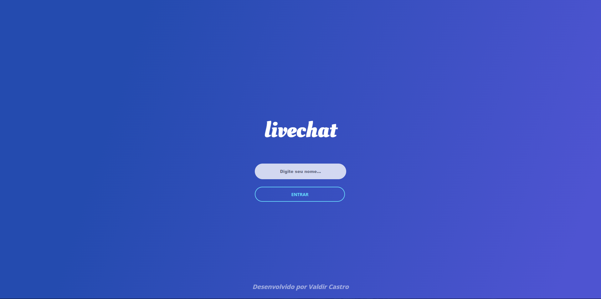

# 📭 Live Chat

https://github.com/valdircaf/LiveChat/assets/70548483/1fc2dc4d-7dc4-46db-b51f-d85251827450

# ⁉️ Sobre o projeto

Live Chat é um aplicativo desenvolvido para conversas simultâneas. Era um projeto que eu queria fazer há algum tempo, mas nunca parei para desenvolver 😂. Utilizei o Web Socket para desenvolver a característica simultânea.



# 🛠️ Tecnologias 
- Java 17
- Spring Boot
- Web Socket
- HTML
- CSS
- Javascript

# Como executar o projeto

```bash
# Clonar repositório
git clone git@github.com:valdircaf/LiveChat.git

# Executar o projeto
./mvnw spring-boot:run
```

# Autor

Valdir Castro

https://www.linkedin.com/in/valdir-castro10

## License
[](https://github.com/valdircaf/LiveChat/blob/main/LICENSE) 

## Link
Este projeto está disponível no link abaixo:
[Acessar site](https://livechat-hkgu.onrender.com/)

O acesso talvez demore um pouco, pois está hospedado em servidor gratuito, no qual fica inativo após 30 min de ociosidade do site.

